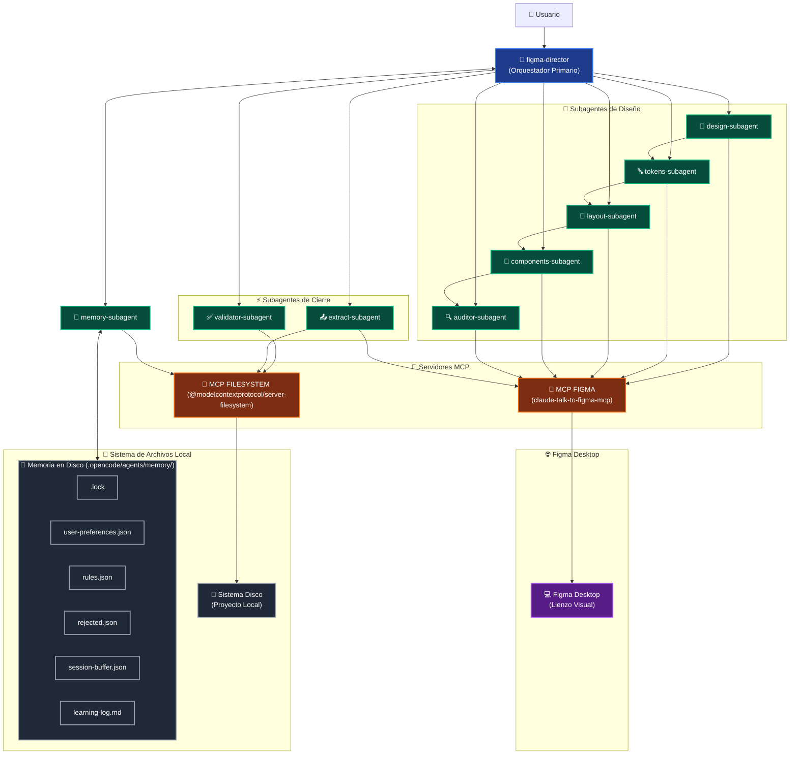

<div align="center">

# Figma AI Agent System


<br>

[](https://nodejs.org/)
[](LICENSE)
[](https://www.figma.com/downloads/)
[](https://opencode.ai/)

<br>

> El sistema procesa instrucciones en lenguaje natural para que el ecosistema de agentes genere la interfaz directamente en Figma, validando de forma nativa el uso de grids, jerarquías tipográficas, variables del sistema de componentes y pautas de accesibilidad WCAG.

</div>

---

## ¿Qué hace este sistema?

Este proyecto automatiza tu flujo de trabajo en Figma mediante un sistema multiagente controlado por lenguaje natural. En lugar de renderizar imágenes estáticas, este equipo de agentes genera maquetas reales directamente en tu archivo de Figma Desktop, configurando AutoLayout, variables de color, tokens tipográficos y ejecutando una auditoría de accesibilidad WCAG 2.1 AA en tiempo real.

El sistema genera elementos listos para producción:

*   **Estructuras complejas:** Diseña tarjetas, formularios y layouts completos usando AutoLayout real, no vectores sueltos.
*   **Paletas de color inteligentes:** Crea esquemas de color con validación de contraste automatizada integrada.
*   **Sistemas de tokens nativos:** Traduce tus decisiones de diseño (color, espaciado, tipografía) en variables nativas de Figma.
*   **Componentes interactivos:** Desarrolla componentes reutilizables con variantes de estado configuradas (Default, Hover, Disabled).
*   **Extracción y validación automática de `DESIGN.md`:** Genera, linteriza y valida en memoria la guía de estilo física de tu lienzo para que actúe como la única fuente de verdad (*Single Source of Truth* - SSoT) del proyecto.
*   **Aprendizaje evolutivo de preferencias:** Aprende activamente de tu comportamiento, consolidando reglas de diseño a largo plazo y adaptando las interfaces a tus elecciones cromáticas o de redondeo favoritas.
*   **Comandos de control de memoria:** Control absoluto sobre tu datos e historial mediante comandos sencillos en el chat para olvidar correcciones, marcar sesiones atípicas o consultar el estado de tu aprendizaje.

---

## Arquitectura del sistema

Para coordinar el flujo, el `figma-director` orquesta un pipeline secuencial donde cada subagente especializado ejecuta una fase específica. En lugar de mutar el flujo a ciegas, el Director mantiene un objeto de estado central (**State JSON**) que se actualiza constantemente con los deltas de datos estructurados que devuelve cada subagente.

El sistema utiliza una arquitectura radial. Los agentes no se comunican de forma directa entre sí; toda transferencia de información ocurre mediante deltas inyectados de regreso al Director, que a su vez orquesta las peticiones a los servidores MCP (Model Context Protocol).

### Diagrama de Integración del Sistema



**Canal de comunicación:** `figma-director` → MCP Server (`claude-talk-to-figma-mcp`) → WebSocket (puerto 3055) → Plugin Figma Desktop

### Subagentes y responsabilidades

| Agente | Fase | Responsabilidad |
| :--- | :--- | :--- |
| `figma-director` | Orquestador | Conecta al WebSocket, planifica, delega e integra transaccionalmente los deltas de cada subagente. |
| `memory-subagent` | Fase 0 & Cierre | Carga, decae y actualiza la memoria histórica en capas. Escribe en `user-preferences.json`, `rules.json`, `rejected.json`, `session-buffer.json` y `learning-log.md`. |
| `design-subagent` | Fase 1 | Propone la identidad visual (paleta, tipografía y principios UX) y genera de forma obligatoria la Matriz de Contraste pre-calculada. |
| `tokens-subagent` | Fase 2A | Realiza Dry-Run de tokens en Figma, aplica control *shift-left* WCAG AA en ad-hocs y crea variables en orden invariable (`STRING → COLOR → FLOAT → BOOLEAN`). |
| `layout-subagent` | Fase 2B | Construye los frames base con AutoLayout aplicando la Ley del 8px Grid; realiza bindings de tokens e inyecta iconos vectoriales sanitizados. |
| `components-subagent` | Fase 3 | Clasifica, filtra el inventario Figma para evitar duplicados, componentiza estructuras físicas y consolida variantes (`PropName=Value`) en Component Sets. |
| `auditor-subagent` | Fase 4 | Inspecciona el lienzo, realiza auditorías WCAG individuales sobre ad-hocs o cambios, ejecuta auto-remediación cromática y depura capas huérfanas o vacías. |
| `extract-subagent` | Cierre (Auxiliar) | Extrae deterministamente el sistema físico de tokens, componentes y layouts de Figma, y genera y escribe el archivo `DESIGN.md` en la raíz. |
| `validator-subagent` | Cierre (Auxiliar) | Linteriza y valida 100% en memoria (sin shell) la integridad semántica y matemática del `DESIGN.md` escrito por el extractor. |

### Flujo secuencial de fases del Pipeline

```mermaid
graph LR
    F0["🧠 Fase 0: Carga de Memoria <br>(memory-subagent)"] --> F1["🎨 Fase 1: Identidad Visual <br>(design-subagent)"]
    F1 --> Decid{"❓ ¿Usuario aprueba?"}
    
    Decid -- "Sí" --> F2A["🔤 Fase 2A: Tokens Dry-Run <br>(tokens-subagent)"]
    Decid -- "No (Máx 3 veces)" --> Replan["❌ Re-planificación / Ajuste"]
    Replan --> F1
    
    F2A --> F2B["📐 Fase 2B: Contenedores & Grid <br>(layout-subagent)"]
    F2B --> F3["🧩 Fase 3: Componentes & Variantes <br>(components-subagent)"]
    F3 --> F4["🔍 Fase 4: Auditoría & WCAG <br>(auditor-subagent)"]
    
    F4 --> Ext["📤 Cierre: Extracción DESIGN.md <br>(extract-subagent)"]
    Ext --> Val["✅ Cierre: Linter en Memoria <br>(validator-subagent)"]
    Val --> MemCierre["🧠 Cierre: Consolidación Memoria <br>(memory-subagent)"]
    
    %% Definiciones de estilos
    classDef completedStyle fill:#064e3b,stroke:#10b981,stroke-width:2px,color:#fff;
    classDef decisionStyle fill:#78350f,stroke:#f59e0b,stroke-width:2px,color:#fff;
    classDef rejectStyle fill:#7f1d1d,stroke:#ef4444,stroke-width:2px,color:#fff;
    
    class F0,F1,F2A,F2B,F3,F4,Ext,Val,MemCierre completedStyle;
    class Decid decisionStyle;
    class Replan rejectStyle;
```



### Mecanismos Clave del Pipeline

*   **Secuencia bloqueante 2A → 2B:** El `layout-subagent` requiere obligatoriamente el `variableMap` generado y fusionado por el `tokens-subagent` en el State central para poder realizar el binding de variables a los nodos en Figma. Esto neutraliza las condiciones de carrera y la creación de colores ad-hoc sin tokenizar.
*   **Estado central transaccional y checkpoints:** El Director mantiene un único JSON inmutable en su estructura. Guarda checkpoints firmes en `checkpoints.lastCompletedPhase` tras completar con éxito cada fase del pipeline. Si hay una desconexión, el sistema lee el buffer y continúa en la fase subsiguiente, evitando rehacer maquetas desde cero.
*   **Staging area de aprobación (`pending_approval.json`):** Los deltas visuales de la Fase 1 no se aplican directamente en el canvas de Figma. Se guardan en una zona de staging temporal en disco (`pending_approval.json`) a la espera de que el usuario apruebe o rechace la propuesta de diseño. Si el usuario abandona la sesión, los datos se recuperan en el siguiente arranque.
*   **Protocolo Anti-Bucle:** Si un subagente falla 3 veces consecutivas reportando el mismo error en una llamada MCP o paso lógico, el Director **ABORTA** la sesión inmediatamente, elimina el archivo de bloqueo `.lock`, expone el error técnico exacto al usuario en el chat y se queda en espera de instrucciones manuales.
*   **Cálculo WCAG inline:** La validación de contraste WCAG AA (mínimo de 4.5:1) se ejecuta localmente mediante la fórmula matemática de luminancia relativa:
    $$L = 0.2126 \cdot R + 0.7152 \cdot G + 0.0722 \cdot B$$
    Esto independiza a los subagentes de APIs o utilidades de red de terceros.

---

## Subsistema de memoria

El Figma AI Agent System incorpora un subsistema de adaptabilidad a largo plazo que le permite aprender de tu estilo de diseño de forma persistente y no destructiva.

### Archivos de memoria persistente

La base de datos de comportamiento reside en la carpeta `.opencode/agents/memory/` y se compone de la siguiente estructura:

| Archivo | Icono | Tipo | Función | Ciclo de vida |
| :--- | :---: | :---: | :--- | :--- |
| `user-preferences.json` | 👤 | JSON | Almacena los overrides subjetivos del usuario (border-radius, tipografías del sistema, escalas métricas) acompañados de un nivel de confianza (`confidence`) y contador de sesiones confirmadas. | Se lee en la **Fase 0**; se escribe/actualiza durante el **Cierre**. |
| `rules.json` | 📜 | JSON | Reglas explícitas de comportamiento autogeneradas basadas en correcciones reiteradas (poseen triggers, acciones y estado de activación). | Se lee en la **Fase 0**; se escribe/actualiza durante el **Cierre**. |
| `rejected.json` | 🚫 | JSON | Registro negro de propuestas estéticas (paletas, tipografías, layouts) descartadas expresamente por el usuario en la Fase 1. Previene propuestas repetitivas y caduca automáticamente a las 10 sesiones. | Se lee en la **Fase 0**; se escribe/actualiza durante el **Cierre**. |
| `session-buffer.json` | ⏳ | JSON | Archivo transaccional que registra en tiempo real las aprobaciones, rechazos, correcciones manuales y checkpoints de la sesión activa para garantizar la tolerancia a interrupciones. | Se lee en la **Fase 0**; se actualiza activamente durante las **Fases 1-4** y el **Cierre**. |
| `learning-log.md` | 📝 | Markdown | Diario de ingeniería cronológico legible por humanos que detalla el aprendizaje del sistema. Implementa autocompresión cuando supera las 1500 palabras, condensando las entradas antiguas a 5 balas generalizadas y reteniendo solo las últimas 5 detalladas. | Se escribe únicamente en la fase de **Cierre (Fase Final)**. |
| `.lock` | 🔒 | Archivo físico | Archivo de exclusión mutua que previene ejecuciones paralelas concurrentes inyectando el PID del proceso y timestamp. | Se crea/verifica en la **Fase 0** y se elimina físicamente en el **Cierre** o ante fallas críticas. |

#### Ciclo de Lectura/Escritura de la Memoria en el Ciclo de Vida

```mermaid
graph TD
    %% Fases Temporales
    F0["🚀 Fase 0 (Inicio)"] --> F14["⚙️ Fases 1-4 (Ejecución)"]
    F14 --> FFinal["🏁 Fase Final (Cierre)"]
    
    %% Archivos de Memoria
    UserPref["👤 user-preferences.json"]
    RulesJson["📜 rules.json"]
    RejectedJson["🚫 rejected.json"]
    SessionBuf["⏳ session-buffer.json"]
    LockFile["🔒 .lock"]
    LearningLog["📝 learning-log.md"]
    
    %% Conexiones Fase 0
    F0 -.->|LECTURA| UserPref
    F0 -.->|LECTURA| RulesJson
    F0 -.->|LECTURA| RejectedJson
    F0 -.->|LECTURA| SessionBuf
    F0 ==>|CREACIÓN / VERIFICACIÓN| LockFile
    
    %% Conexiones Fases 1-4
    F14 ==>|ESCRITURA <br>(Aprobación, Rechazo, Corrección, Checkpoint)| SessionBuf
    
    %% Conexiones Fase Final
    FFinal ==>|ESCRITURA| UserPref
    FFinal ==>|ESCRITURA| RulesJson
    FFinal ==>|ESCRITURA| RejectedJson
    FFinal ==>|ESCRITURA (Cierre)| SessionBuf
    FFinal ==>|ESCRITURA| LearningLog
    FFinal -->|ELIMINACIÓN| LockFile
    
    %% Estilos de enlaces (Lectura = Azul, Escritura = Naranja, Eliminación = Rojo)
    linkStyle 0,1 stroke:#9ca3af,stroke-width:2px;
    linkStyle 2,3,4,5,6 stroke:#3b82f6,stroke-width:2px;
    linkStyle 7,8,9,10,11,12 stroke:#f97316,stroke-width:3px;
    linkStyle 13 stroke:#ef4444,stroke-width:3px;
```

### Exclusión Mutua (Lock File)

Al arrancar la Fase 0, el `memory-subagent` comprueba y crea un archivo de bloqueo físico en `.opencode/agents/memory/.lock` inyectando su PID de proceso y timestamp.
*   **Si el lock existe y tiene menos de 30 minutos:** Aborta inmediatamente impidiendo ejecuciones paralelas concurrentes que corrompan el canvas o la base de datos de memoria.
*   **Si el lock tiene más de 30 minutos (huérfano):** Toma el control, sobrescribe el archivo y prosigue de forma normal.
*   Al cerrar la sesión de forma exitosa o ante errores críticos del pipeline, el archivo `.lock` se elimina físicamente del disco.

### Sistema de Confianza Evolutiva e Inactividad

| Evento | Efecto | Delta numérico | Límite |
| :--- | :--- | :---: | :---: |
| **Corrección manual (primera vez)** | ✅ Registro e inicialización de la preferencia en memoria. | Confianza = `0.60` | Valor inicial |
| **Corrección manual (recurrente)** | ✅ Incremento de confianza por confirmación continua en sesiones subsecuentes. | `+0.10` | Máximo `0.99` |
| **Aprobación activa** | ✅ Incremento por coincidencia final entre el lienzo físico (`DESIGN.md`) y la preferencia. | `+0.05` | Máximo `0.99` |
| **Regla cumplida** | ✅ Aumento automático en cada sesión subsecuente que se confirme su trigger. | `+0.10` | Máximo `0.99` |
| **Regla contradicha** | ❌ Penalización y reducción drástica de confianza por comportamiento opuesto del usuario. | `-0.20` | Mínimo `0.00` |
| **Inactividad > 30 días** | ⏳ Decaimiento por desuso detectado al inicio de la Fase 0. | `-0.05` | Reducción periódica |
| **Confianza < 0.3** | ❌ La preferencia se limpia de la base de datos y se restablece a `null`. | Olvido físico | Umbral de borrado |
| **Confianza < 0.4** | ❌ La regla aprendida se deshabilita para evitar su aplicación automática. | `active: false` | Umbral de desactivación |

### Separación Global vs. por Proyecto

Toda la base de datos de memoria soporta una carga y persistencia en dos capas independientes:
*   Las entradas (preferencias, reglas, rechazos) pueden poseer el campo `"projectId": null` (global) o `"projectId": "nombre_proyecto"` (específico).
*   En la Fase 0 se cargan y fusionan ambas capas. En caso de colisión de un mismo token o comportamiento, **las especificaciones del proyecto ganan** y sobrescriben las reglas globales, permitiendo al agente adaptarse a identidades de marca completamente distintas.

---

## Mecanismos de seguridad

Para garantizar una operación limpia y proteger la infraestructura del usuario contra inyecciones y fugas de datos, el sistema implementa los siguientes protocolos:

1.  **Validación 100% en Memoria (Sin Shell):**  
    El linting y análisis de consistencia del `DESIGN.md` en el `@validator-subagent` se ejecuta estrictamente de forma nativa en memoria (realizando parsing de YAML/JSON y escaneo sintáctico directamente sobre el buffer leído por `view_file`). Queda **estrictamente prohibido** el uso de herramientas de shell, terminal o subprocesos (ej: `run_command` o comandos npm locales). Esto mitiga por completo las vulnerabilidades de Ejecución Remota de Código (RCE) por inyección de caracteres maliciosos en nombres de componentes de Figma.
2.  **Protección de Credenciales de Figma (`FIGMA_PAT`):**  
    El Personal Access Token de Figma es una credencial de nivel administrador y **nunca debe ser hardcodeada** en el código fuente, JSONs o prompts del agente. El sistema exige su lectura dinámica desde el entorno del sistema y la inyección a través de la sintaxis dinámica `"${env:FIGMA_PAT}"` de Opencode en el archivo de configuración.
3.  **Guard de Integridad del State:**  
    El `figma-director` actúa como un firewall de datos. Antes de consolidar cualquier delta JSON recibido de los subagentes, valida exhaustivamente su estructura y tipados para prevenir la inyección de tipos silenciosos incorrectos o datos malformados que corrompan el State central.
4.  **Staging de Aprobación Obligatorio:**  
    Las propuestas estéticas de la Fase 1 se aíslan en `.opencode/pending_approval.json` y requieren aprobación humana expresa antes de mutar o escribir cualquier variable o nodo en Figma Desktop.

---

## Requisitos previos

| Herramienta | Versión mínima | Instalación / Configuración |
| :--- | :--- | :--- |
| [Node.js](https://nodejs.org/) | ≥ 20 LTS | Descarga el instalador LTS de nodejs.org. |
| [Git](https://git-scm.com/) | Reciente | `git-scm.com/download` en Windows o `brew install git` en macOS. |
| [Figma Desktop](https://www.figma.com/downloads/) | Actual | Descarga e instala en figma.com/downloads. **La versión web no es compatible.** |
| [Opencode](https://opencode.ai/) | Actual | Ver instrucciones de instalación en sección inferior. |
| **Variable `FIGMA_PAT`** | PAT de Figma | Token obtenido en *Figma → Settings → Security → Personal access tokens*. Debe configurarse obligatoriamente en las variables de entorno del sistema operativo. |

---

## Instalación

### 1. Instala Node.js
Descarga e instala la versión LTS desde [nodejs.org](https://nodejs.org/) y verifica en terminal:
```bash
node --version
# Debe retornar v20.x.x o superior
```

### 2. Instala Figma Desktop
Instala la app nativa desde [figma.com/downloads](https://www.figma.com/downloads/), ábrela e inicia sesión.

### 3. Instala Opencode
**En Windows (PowerShell):**
```bash
npm i -g opencode-ai
```
**En macOS / Linux:**
```bash
curl -fsSL https://opencode.ai/install | bash
```

### 4. Clona el repositorio
```bash
git clone https://github.com/osCeballos/figma-ai-agent-system.git
cd figma-ai-agent-system
```
*Este proyecto no tiene dependencias npm directas en el directorio. No requiere ejecutar `npm install`.*

---

## Configuración

El único archivo de configuración que necesitas configurar es `opencode.json` en la raíz de tu proyecto. El repositorio cuenta con una plantilla completamente lista para operar que inyecta de forma segura tu token de Figma desde las variables del sistema operativo:

```json
{
  "name": "Figma AI Agent System",
  "mcpServers": {
    "figma": {
      "type": "local",
      "command": "npx",
      "args": ["-y", "claude-talk-to-figma-mcp"],
      "enabled": true,
      "environment": {
        "FIGMA_PAT": "${env:FIGMA_PAT}",
        "__comment_FIGMA_PAT": "El token de Figma nunca debe ser expuesto en texto plano en los archivos del proyecto. Se lee desde la variable de entorno FIGMA_PAT del sistema."
      }
    },
    "filesystem": {
      "type": "local",
      "command": "npx",
      "args": ["-y", "@modelcontextprotocol/server-filesystem", "."],
      "enabled": true
    }
  }
}
```

> [!WARNING]
> Nunca hardcodees tu token de Figma en texto claro en `opencode.json`. Asegúrate de guardarlo en tu variable de entorno `FIGMA_PAT` de tu sistema operativo para evitar filtraciones críticas de tus claves en el repositorio de Git.

---

## Uso

### 1. Arrancar el servidor WebSocket y el plugin
El plugin nativo de Figma se comunica con los agentes mediante un servidor WebSocket local en el puerto **3055**. Levanta el servidor con el siguiente comando:
```bash
npx -y claude-talk-to-figma-mcp
```
*Mantén esta terminal activa mientras diseñas. Si se cierra, los agentes perderán la conexión.*

### 2. Instalar el Plugin en Figma Desktop
1.  Abre la aplicación de **Figma Desktop**.
2.  Haz clic en el logo de Figma → **Plugins → Development → Import plugin from manifest...**
3.  Selecciona el archivo `manifest.json` ubicado en la carpeta caché global de npx de tu sistema operativo (habitualmente `%APPDATA%\npm-cache\_npx` en Windows o `~/.npm/_npx` en macOS, bajo la subcarpeta de `@arinspunk/claude-talk-to-figma-mcp`). Consulte la [guía de conexión oficial del MCP](https://github.com/arinspunk/claude-talk-to-figma-mcp) si tienes problemas localizando la ruta exacta.

### 3. Diseñar con Opencode
1.  Abre un archivo de diseño en Figma Desktop.
2.  Ejecuta el plugin: **Plugins → Development → Talk to Figma** y copia el **número verde de canal**.
3.  En otra terminal, dentro del proyecto local, arranca Opencode:
    ```bash
    opencode
    ```
4.  Lanza tu instrucción indicando el canal en el chat:
    ```
    Conecta con Figma, canal 7
    ```
5.  Proporciona tu brief de diseño en lenguaje natural.

#### Ejemplos de prompts:
```
Diseña una tarjeta de producto moderna para una tienda de calzado. Debe incluir AutoLayout, un botón interactivo y usar una tipografía minimalista de mi escala.
```
```
Crea una interfaz de pantalla de login responsiva para una Fintech en modo oscuro.
```

### 4. Scripts de Inicio Rápido (Opcional)
Para levantar todo el ecosistema con un doble clic, puedes ejecutar los scripts preconfigurados en el repositorio:
*   **En Windows:** Haz doble clic en `iniciar.bat`
*   **En macOS:** Otorga permisos ejecutables `chmod +x iniciar.command` y lánzalo.

### 5. Comandos de Control de Memoria en el Chat

Puedes introducir estos comandos directamente en la barra de chat de Opencode en cualquier punto de la sesión:

| Comando | Modo del subagente | Acción del Sistema | Ejemplo |
| :--- | :---: | :--- | :--- |
| **`OLVIDA ULTIMA CORRECCION`** <br>(o **`OLVIDA`**) | `revert_last_correction` | Llama al `@memory-subagent` para eliminar el último evento de corrección del buffer en disco y revertir la subida de confianza aplicada a la preferencia. | *"Olvida mi última corrección de border-radius"* |
| **`SESION ATIPICA`** | `atypical_session` | Marca la sesión activa como atípica. Al cerrar, se omitirá por completo la consolidación de lecciones, reglas o preferencias en las bases de datos permanentes. | *"Marca esta interacción como sesión atípica"* |
| **`DESACTIVA REGLA [id_regla]`** | `disable_rule` | Deshabilita la regla indicada tanto del disco físico como del State activo. | *"DESACTIVA REGLA R-102"* |
| **`QUE HAS APRENDIDO DE MI`** <br>(o **`ESTADO DE MEMORIA`**) | `diagnostic` | Llama al `@memory-subagent` para desplegar un reporte Markdown estético con tus preferencias, reglas activas y estadísticas históricas. | *"¿Qué has aprendido de mí en este proyecto?"* |

> [!NOTE]
> **Reanudación de sesiones interrumpidas:** Al arrancar en Fase 0, si el Director detecta un estado `"interrupted"` en `session-buffer.json`, te preguntará si deseas recuperar la sesión. Al responder que sí, el sistema cargará transaccionalmente el State y reanudará el pipeline en el paso exacto posterior a `lastCompletedPhase`.

---

## Estructura del proyecto

```
figma-ai-agent-system/
│
├── .opencode/
│   ├── agents/
│   │   ├── figma-director.md           ← Orquestador central del pipeline
│   │   ├── memory-subagent.md          ← Fase 0 y Cierre: Contexto evolutivo
│   │   ├── design-subagent.md          ← Fase 1: Criterio visual y accesibilidad
│   │   ├── tokens-subagent.md          ← Fase 2A: Variables, colecciones y Dry-Run
│   │   ├── layout-subagent.md          ← Fase 2B: Contenedores AutoLayout y 8px grid
│   │   ├── components-subagent.md      ← Fase 3: Componentes maestros y variantes
│   │   ├── auditor-subagent.md         ← Fase 4: Auditoría e higiene de capas
│   │   ├── extract-subagent.md         ← Cierre (Auxiliar): Extractor del canvas físico
│   │   ├── validator-subagent.md       ← Cierre (Auxiliar): Linter e integrador en memoria
│   │   ├── GLOSSARY.md                 ← Glosario técnico oficial de terminologías
│   │   │
│   │   └── memory/                     ← Base de datos de persistencia evolutiva
│   │       ├── .lock                   ← Archivo de bloqueo contra concurrencia
│   │       ├── user-preferences.json   ← Overrides y confianzas (Global / Proyecto)
│   │       ├── rules.json              ← Reglas aprendidas automáticamente (3 sesiones)
│   │       ├── rejected.json           ← Registro de propuestas de estilo descartadas
│   │       ├── session-buffer.json     ← Búfer transaccional de eventos y checkpoints
│   │       └── learning-log.md         ← Bitácora cronológica con autocompresión
│   │
│   └── skills/                         ← Algoritmos locales de ejecución estática
│       ├── css-to-figma-api/           ← Especificación Flexbox CSS → API Figma
│       ├── design-patterns/            ← Patrones UX (formularios, menús, etc.)
│       ├── design-system-reference/    ← Reglas de validación e integridad del DESIGN.md
│       ├── figma-grid-calculus/        ← Validación y cálculo de múltiplos de 8px
│       ├── svg-library/                ← Librería de SVGs locales y registro
│       └── wcag-calculator/            ← Algoritmo matemático local de luminancia relativa
│
├── DESIGN.md                           ← Single Source of Truth del diseño (Generado automáticamente)
├── iniciar.bat                         ← Script de arranque rápido (Windows)
├── iniciar.command                     ← Script de arranque rápido (macOS/Linux)
├── LICENSE                             ← Licencia MIT de distribución libre
├── opencode.json                       ← Configuración segura de servidores MCP
├── .gitignore
└── README.md
```

> [!NOTE]
> `DESIGN.md` se genera y actualiza automáticamente mediante el `@extract-subagent`. **En la primera ejecución este archivo no existirá** — el Director te pedirá confirmación para generarlo antes de iniciar el pipeline. No lo edites a mano. Para regenerarlo en sesiones posteriores, dile al agente: _"Actualiza el sistema de diseño"_.

---

## Iconos disponibles

La librería SVG incluye 23 iconos en formato 24×24 px con `currentColor` cargados de forma local e higienizados por el `@layout-subagent`:

`alert` · `arrow-down` · `arrow-left` · `arrow-right` · `arrow-up` · `bell` · `check` · `chevron-down` · `chevron-left` · `chevron-right` · `close` · `copy` · `edit` · `external-link` · `eye` · `home` · `info` · `menu` · `plus` · `search` · `settings` · `trash` · `user`

---

## Créditos

*   **Plugin de conexión con Figma:** [claude-talk-to-figma-mcp](https://github.com/arinspunk/claude-talk-to-figma-mcp) por arinspunk.
*   **Licencia:** MIT — puedes usar, modificar y distribuir libremente en proyectos comerciales y privados.

---

<div align="center">

**Autor:** Oscar Ceballos Cano &nbsp;·&nbsp; **Año:** 2026

</div>
